

   
  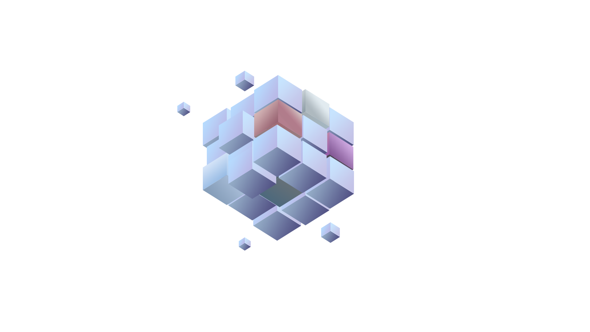
   

 <h3><b>BLOCK STOCK</b></h3>
  블록 코딩을 활용해 자동 매매 프로그램의 로직을 생성하고,  모의 주식에 프로그램을 이용하여 주식 시스템을 체험하는 플랫폼 
  삼성 청년 SW 아카데미 - <b>우수 프로젝트 🏆</b>  
  2023.07.04 ~ 2022.08.18
    

[Notion](https://www.notion.so/OLOCK-BLOCK-STOCK-ec546d1a856f46d098edd1c68037600e)

 

# 🖥 **프로젝트 개요**

### 팀원 소개

<table>
    <tr>
        <td height="140px" align="center"> <a href="https://github.com/alsrbs">
                👑 김민균  (Front-End) </a>  </td>
        <td height="140px" align="center"> <a href="https://github.com/wldbs8241">
                🎀 송지윤  (Front-End) </a>  </td>
        <td height="140px" align="center"> <a href="https://github.com/swy0123">
                🐲 이시영  (Front-End) </a>  </td>
        <td height="140px" align="center"> <a href="https://github.com/KodaHye">
                🐟 고다혜  (Back-End) </a>  </td>
        <td height="140px" align="center"> <a href="https://github.com/hajin618">
                🐰 김하진  (Back-End) </a>  </td>
        <td height="140px" align="center"> <a href="https://github.com/210-reverof">
                💎 이원영  (Back-End) </a>  </td>
    </tr>
</table>

 

### 서비스 배경
* 최근 주식 자동매매에 대해 많은 사람들이 관심을 가지고 있습니다. 또한 증권가에서도 알고리즘 매매에 대한 관심도가 높아져 다양하게 활용되고 있습니다.
  
* 자동 매매의 진입 장벽이 높기 때문에 **자동 매매 전략에 관심은 있지만 전략 정보가 부족한 사람**, **자신만의 전략이 있지만 프로그래밍 능력이 부족한 사람**, 자동매매 전략을 학습하고 있지만, **실제 데이터를 적용하기 힘든 사람**들에게 블록 코딩을 통해 쉽게 자신의 주식 매매 전략을 만들고, 테스트할 수 있는 플랫폼 Block Stock을 기획하게 되었습니다.

 
 

# 🔎 프로젝트 설계
### 시스템 구성도
### ERD

   
  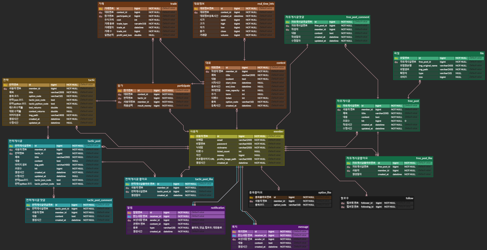
   

 
 

# 🔨 개발 환경 및 기술 스택
### 프론트엔트

 

**Language |** Typescript 5.0.2

**Framework |** React 18.2.0

**Library |** Axios 1.4.0, Styled Components 5.1.26, Recoil 0.7.7

 

### 백엔드

 

**Language |** Java 17, Python 3.7.13

**Framework |** Spring Boot 3.1.1, Fast API 0.103.1

**Data(RDBMS) |** Spring Data JPA 3.0.4

**Build Tool |** Gradle 8.2.3

 

### 인프라

 

**DB |** MariaDB 11

**Server |** Git, SSH, Jenkins, Docker, Docker compose

 

### 외부 API
* 한국투자증권 API
* 대신증권 API
  
  
 
 

# 📚 프로젝트 기능

### 1. 메인화면

   
  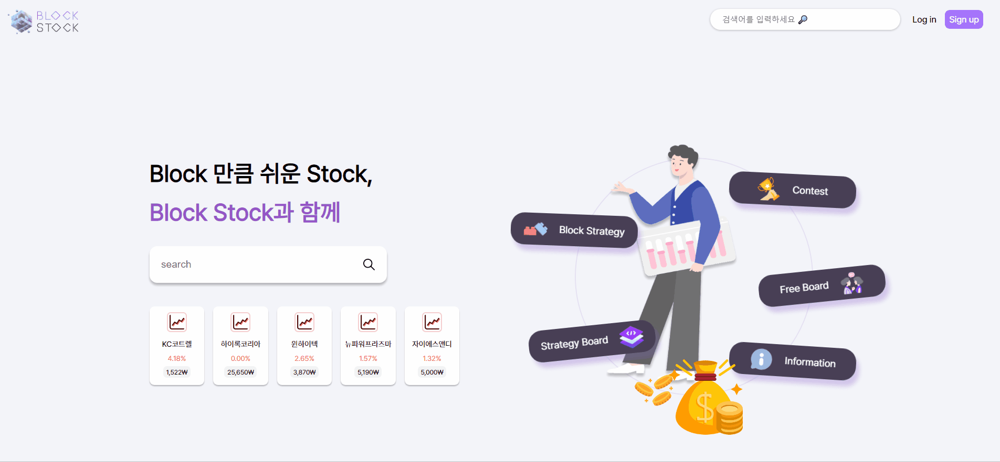
   

* 메인 화면에서는 랜덤 5개의 주식 현재가와 전일 대비율을 조회할 수 있습니다.

* 로그인을 한 뒤, BLOCK STOCK 서비스를 이용할 수 있습니다.

 

### 2. 전략 테스트장

   
  
   

* 블록코딩을 통해 자신만의 주식 매매/매도 전략을 작성할 수 있습니다.

* 만들어진 전략은 종목/기간을 선택하여 선택한 종목의 과거 데이터를 기반으로 테스트를 할 수 있습니다.

 

### 3. 전략 대회

   
  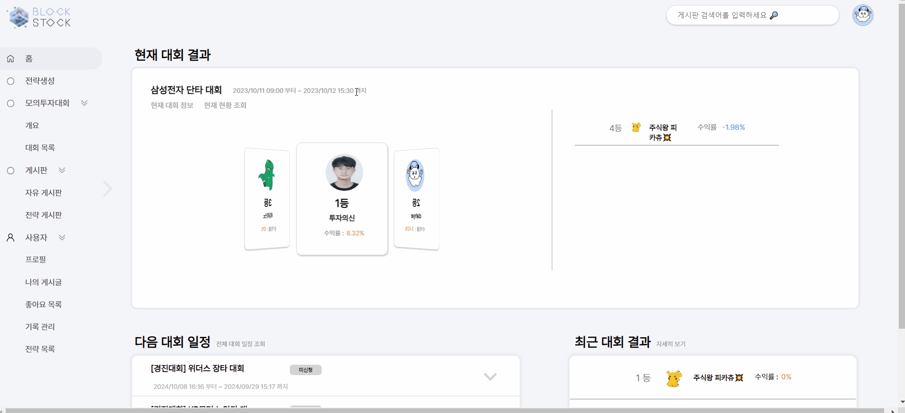
   

* 대회 개요 페이지에서는 현재 진행 중인 대회 랭킹, 예정 대회 목록, 이전 대회 결과를 조회할 수 있습니다.

* 대회 종목에 해당되는 자신의 전략이 있으면, 대회에 참여할 수 있습니다.

 

   
  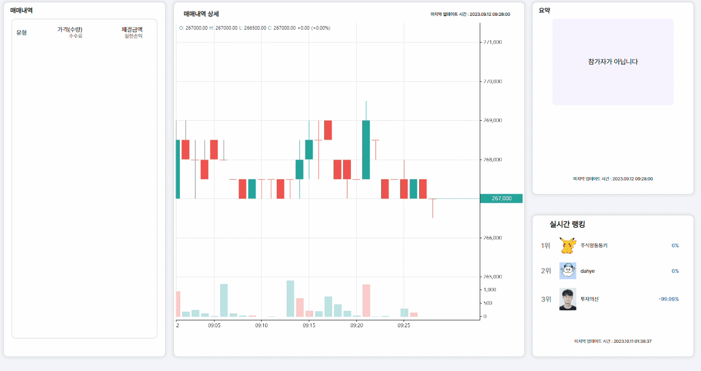
   

* 1분마다 대회 종목의 시가, 고가, 저가, 종가, 거래량 데이터를 가져옵니다.

* 대회가 실행되는 동안 대회 주기(1분) 마다 참가자들의 전략을 실행해, 실시간 순위를 매깁니다.

* 대회 종료 후 1, 2위에게는 우승, 준우승 칭호가 부여됩니다. 칭호는 해당 사용자의 마이 페이지에서 조회할 수 있습니다.

 

### 4. 전략 게시판

   
  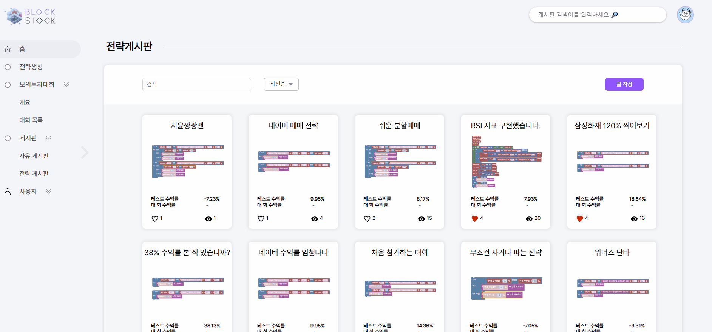
   

* 자신이 만든 전략을 전략게시판을 통해 공유할 수 있습니다.

 

   
  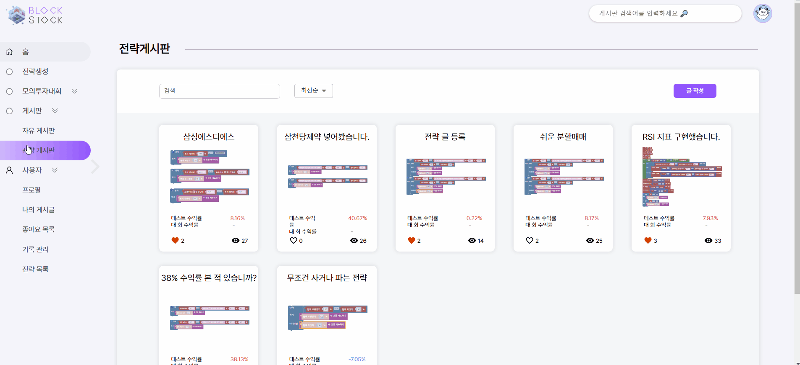
   

* 전략게시글의 내보내기 버튼을 누르면 다른 사람이 만든 전략을 직접 테스트하고 저장할 수 있습니다.

 

### 5. 자유 게시판

   
  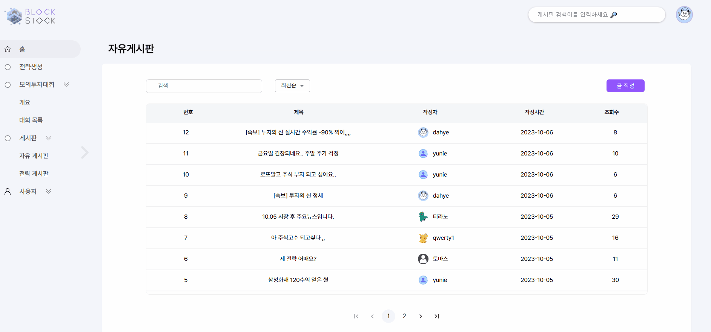
   

* 자유로운 주제로 사용들 간 소통을 할 수 있습니다.

 

### 6. 마이페이지

   
  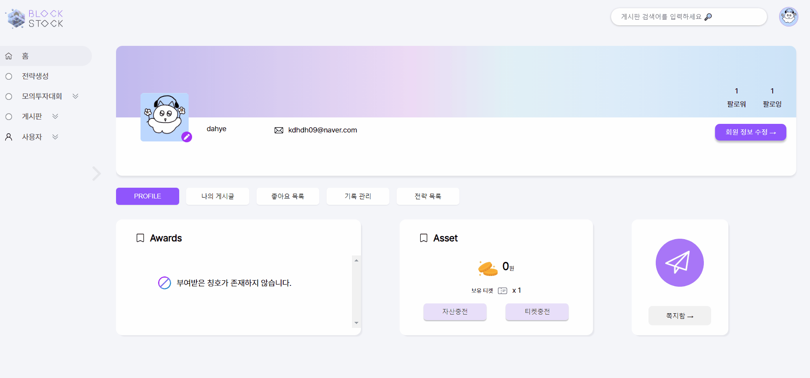
   

* 자신의 마이페이지에서 자산, 작성 게시글, 좋아요한 게시글, 대회 참여 기록을 조회할 수 있습니다.

 

   
  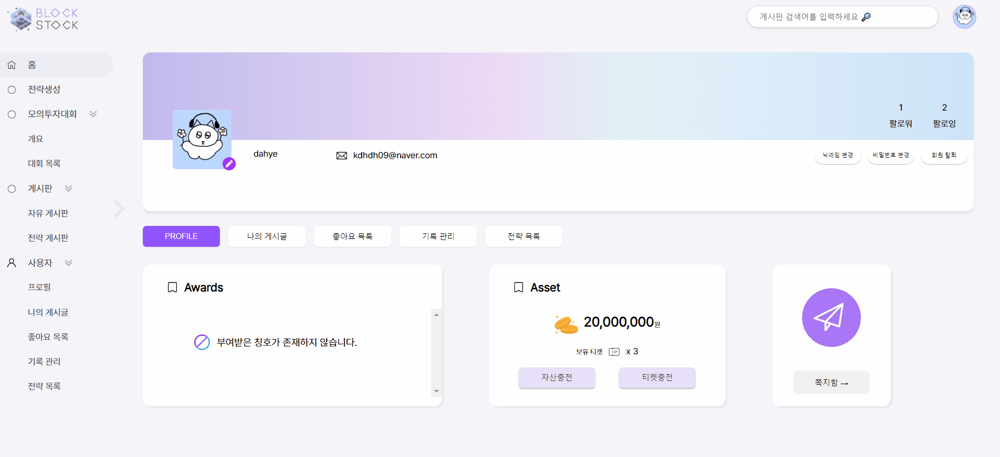
   

* 마이페이지에서 자산 충전과 티켓 교환을 할 수 있습니다.

* 교환한 티켓은 대회 참가 신청 시 사용됩니다.

 

   
  
   

* 사용자는 프로필 이미지, 닉네임, 비밀번호 변경을 할 수 있습니다.

 

   
  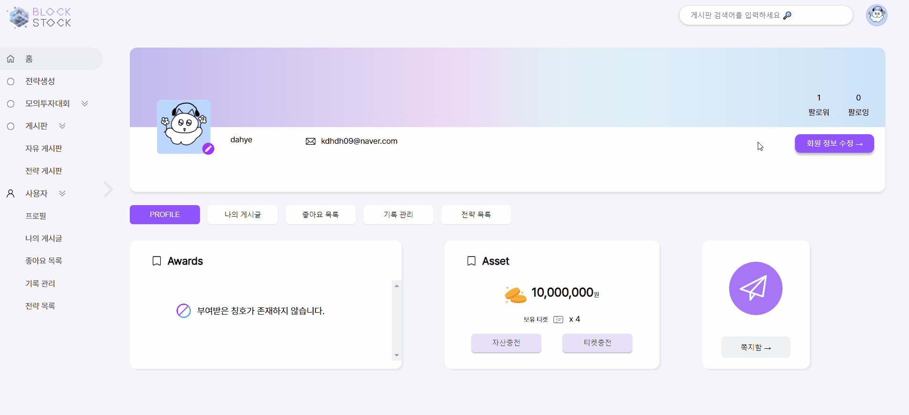
   

* 사용자 간 팔로우를 할 수 있습니다.

 

   
  
   

* 사용자 간 쪽지를 주고 받을 수 있습니다.

* 쪽지를 주고 받은 내역은 자신의 쪽지함에서 조회할 수 있습니다.

 
 

# 프로젝트 산출물
* [와이어프레임](https://www.figma.com/files/project/104993079/Team-project?fuid=985149457451391612)
* [API 명세서](https://verbose-dedication-777.notion.site/API-140111ba33394f2899ad8d8f879e30e7?pvs=4)
* [ERD](https://www.erdcloud.com/d/hCkMg2HYMB6q4vmsC)
* [회의록](https://verbose-dedication-777.notion.site/1fbdd03ebd234b3280073bc0bb5bf211?pvs=4)
  
